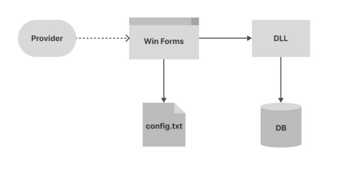
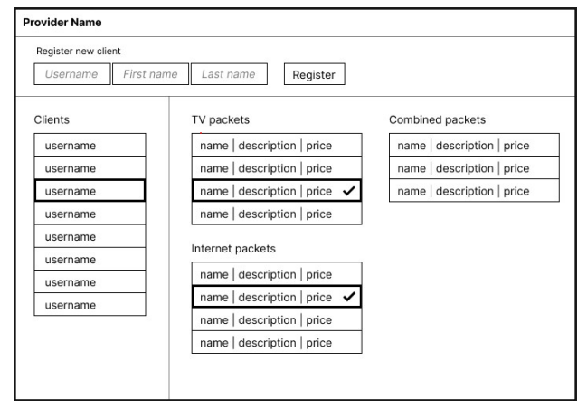

# System for Internet and TV Providers

The project task involves creating a **.NET library** and a **graphical application** for Internet and TV providers.

The library should be created as a **Class Library** project and exported for use as a **DLL**, while the graphical application should be created as a **Windows Forms App** project that will allow the provider to use the library through a graphical interface.

  

## Task Description

The provider uses the graphical application to manage **service packages** used by **clients**. The data for **clients** and **packages** is stored in a database and can be managed as follows:
* Adding a new package
* Adding a new client
* Activating the desired package for a specific client
* Deactivating the desired package for a specific client

Additionally, the data can be retrieved from the database in the following ways:
* Reading a list of all registered clients
* Reading a list of all created packages
* Reading a list of all packages activated for a specific client

Besides database operations, the application should support reading data from a **config.txt** file where the first line contains the name of the provider using the application (e.g., “SBB”) and the second line contains the connection string for connecting to the provider’s database. This file allows multiple providers to use the same application without any changes, yet still use their own database and have their own provider name displayed.

### Database

The data for a **client** that needs to be stored in the database includes: **username**, **first name**, **last name**.

There are several types of **packages**. For each package, the following is stored in the database: **id**, **name**, **price**. Additionally, depending on the package type, the following data is stored:
* Number of channels for the TV package
* Internet speed for the Internet package
* TV package id, Internet package id for the Combined package

The library should support connections with **at least 2 different types of databases**, e.g., SQLite and MySQL. Depending on the connection string, the application will connect to a specific instance of the appropriate type of database.

### GUI (Graphical User Interface)

The Windows Forms application should provide the following functionalities:
* Display the provider's name
* Display a list of all clients
* Display a list of all packages, separated by type
* Mark packages that are activated for the selected client
* Activate and deactivate packages for the selected client
* Add a new client

An example of the GUI layout showing the required functionalities:

  

### Design Patterns - [Refactoring Guru](https://refactoring.guru/design-patterns/catalog)

The project should utilize the following design patterns:
* Creational patterns
	* Singleton
	* Choose at least **2** others
* Structural patterns
	* Choose at least 1 from: Adapter, Proxy, Decorator
	* Choose at least 1 from: Bridge, Composite, Facade, Flyweight
* Behavioral patterns
	* Choose at least 2, except the Iterator pattern
